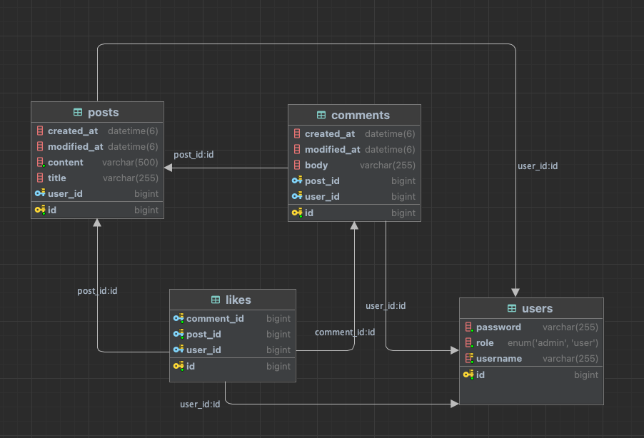
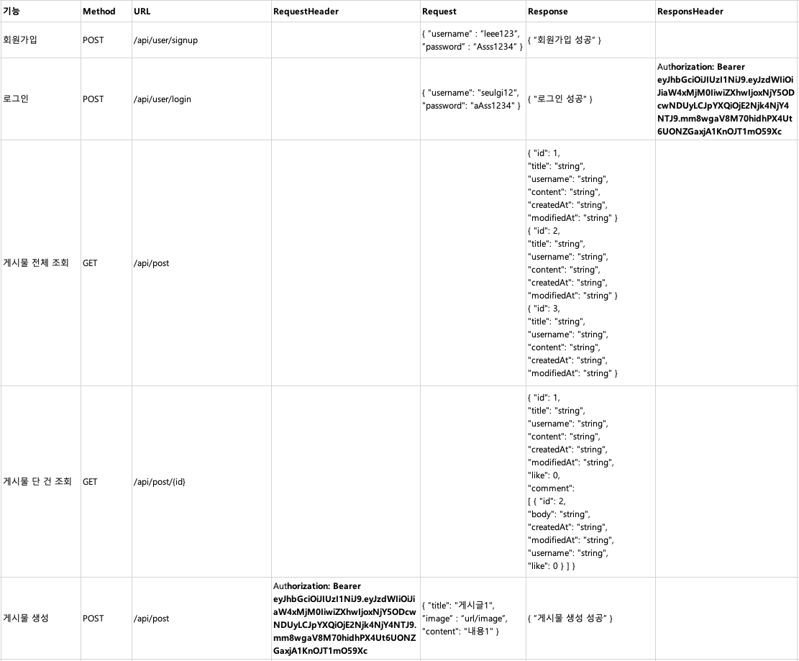
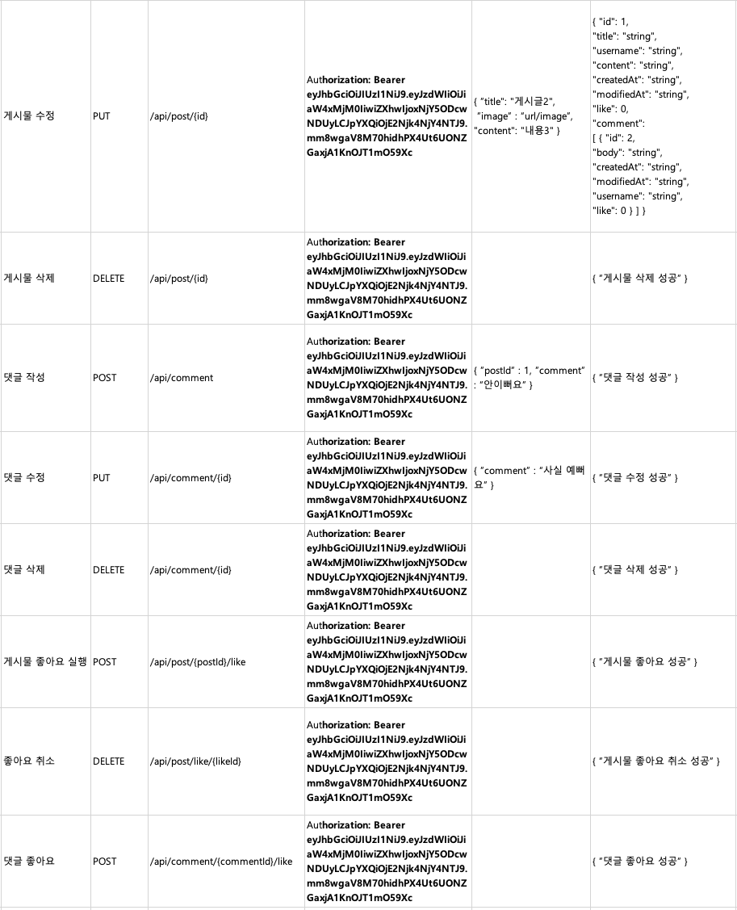

>### ERD 설계

>### API 명세서

> 1. Spring Security를 적용했을 때 어떤 점이 도움이 되셨나요?
- 인증과 권한을 부여를 쉽게 가능하게 하였다. 
> 2. Spring Security를 사용하지 않는다면 어떻게 인증/인가를 효율적으로 처리할 수 있을까요?
- 
> 3. AOP에 대해 설명해 주세요!
- AOP는 관점지향 프로그래밍으로 어떤 로직을 기준으로 핵심적인 관점, 부가적인 관점으로 나눠서 보고 그 관점을 기준으로 각각 모듈화하는 것 
> 4. RefreshToken 적용에 대한 장/단점을 작성해 주세요! 적용해 보지 않으셨다면 JWT를 사용하여 인증/인가를 구현 했을 때의 장/단점에 대해 숙련주차의 답변을 Upgrade 하여 작성해 주세요!
- 
> 5. 즉시로딩 / 지연로딩에 대해 설명해 주세요!
- JPA는 데이터를 조회할 때 FetchType으로 지연로딩과, 즉시로딩이 있다. 
- 즉시 로딩은 데이터를 조회할 때, 연관된 모든 객체의 데이터까지 한번에 불러오는 것
- 지연 로딩은 필요한 시점에 연관된 객체의 데이터를 불러오는 것 

